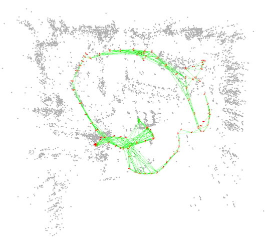
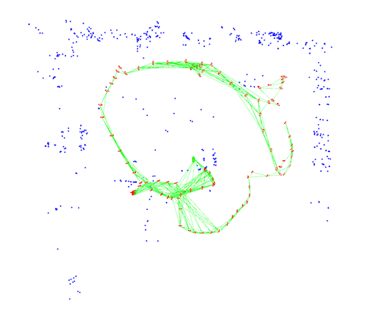
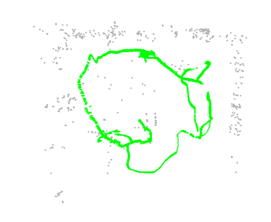

<div align="center">
<h1>SLAM-Map-Compression </h1>
<h3>Efficient Map Sparsification Based on 2D and 3D Discretized Grids</h3>

ArXiv Preprint ([arXiv 2303.10882](https://arxiv.org/abs/2303.10882))

Accepted in **[CVPR 2023](https://openaccess.thecvf.com/content/CVPR2023/html/Zhang_Efficient_Map_Sparsification_Based_on_2D_and_3D_Discretized_Grids_CVPR_2023_paper.html)**
</div>


## Abstract
Localization in a pre-built map is a basic technique for robot autonomous navigation. 
Existing mapping and localization methods commonly work well in small-scale environments. 
As a map grows larger, however, more memory is required and localization becomes inefficient. 
To solve these problems, map sparsification becomes a practical necessity to acquire a subset of the original map for localization. 
Previous map sparsification methods add a quadratic term in mixed-integer programming to enforce a uniform distribution of selected landmarks, 
which requires high memory capacity and heavy computation. 
In this paper, we formulate map sparsification in an efficient linear form and select uniformly distributed landmarks based on 2D discretized grids.
Furthermore, to reduce the influence of different spatial distributions between the mapping and query sequences, 
which is not considered in previous methods, we also introduce a space constraint term based on 3D discretized grids. 
The exhaustive experiments in different datasets demonstrate the superiority of the proposed methods in both efficiency and localization performance.

## Installation

### ORB-SLAM2
The method is tested with [ORB-SLAM2](https://github.com/raulmur/ORB_SLAM2). Please follow their instruction to install prerequisites.

### Gurobi
The mix-integer programming is solved using [GUROBI](https://www.gurobi.com).

### OR-Tools
Here is also a repo using OR-Tools to solve the same problem, [SLAM-Map-Compression-OR-Tools](https://github.com/Bungehurst/SLAM-Map-Compression-OR-Tools).

## Running

The method now is testing with RGBD and stereo mode of ORB-SLAM2, and tested in [ICL-NUIM](https://www.doc.ic.ac.uk/~ahanda/VaFRIC/iclnuim.html),
[EuRoC](https://projects.asl.ethz.ch/datasets/doku.php?id=kmavvisualinertialdatasets), and [KITTI](https://www.cvlibs.net/datasets/kitti/eval_odometry.php)
datasets.

Take EuRoC data for example.

### 1. Build and save an original map
```
Examples/Stereo/stereo_euroc_savemap Vocabulary/ORBvoc.txt Examples/Stereo/EuRoC.yaml PATH_TO_SEQUENCE/mav0/cam0/data PATH_TO_SEQUENCE/mav0/cam1/data Examples/Stereo/EuRoC_TimeStamps/SEQUENCE.txt PATH_TO_MAP 
```


### 2. Compress the original map
```
Examples/Tools/slam_compress_map Vocabulary/ORBvoc.txt Examples/Stereo/EuRoC.yaml PATH_TO_MAP PATH_TO_COMPRESSED_MAP COMPRESS_METHPD
```

COMPRESS_METHOD :

- 1: Compress based only on 2D grids
- 2: Compress based on 2D and 3D grids


### 3. Localize in the compressed map
```
Examples/Stereo/stereo_euroc_localize Vocabulary/ORBvoc.txt Examples/Stereo/EuRoC.yaml PATH_TO_SEQUENCE/mav0/cam0/data PATH_TO_SEQUENCE/mav0/cam1/data Examples/Stereo/EuRoC_TimeStamps/SEQUENCE.txt PATH_TO_COMPRESSED_MAP
```


## Acknowledgements

- [ORB-SLAM2](https://github.com/raulmur/ORB_SLAM2)

- [Active-ORB-SLAM2](https://github.com/XinkeAE/Active-ORB-SLAM2)

## Citation
```bibtex
@InProceedings{Zhang_2023_CVPR,
    author    = {Zhang, Xiaoyu and Liu, Yun-Hui},
    title     = {Efficient Map Sparsification Based on 2D and 3D Discretized Grids},
    booktitle = {Proceedings of the IEEE/CVF Conference on Computer Vision and Pattern Recognition (CVPR)},
    month     = {June},
    year      = {2023},
    pages     = {12470-12478}
}
```
